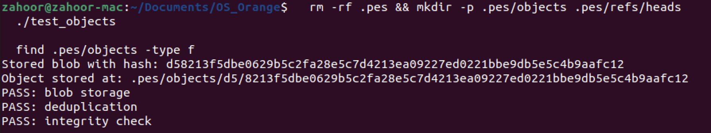
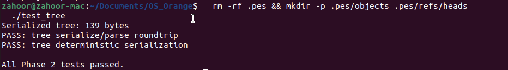
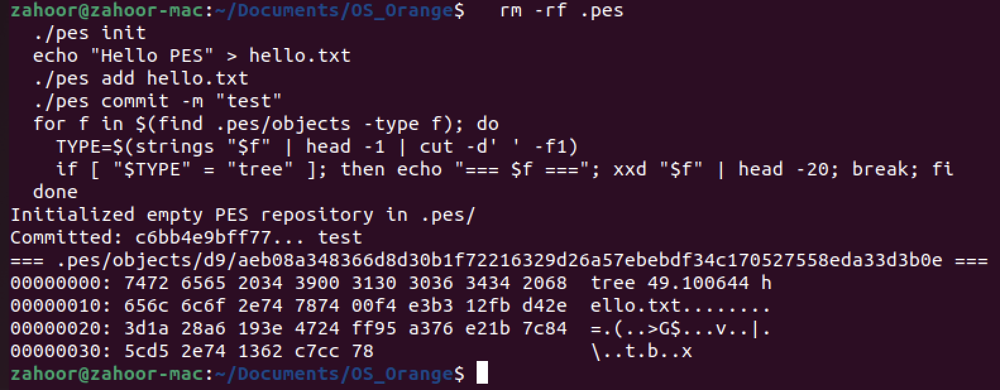
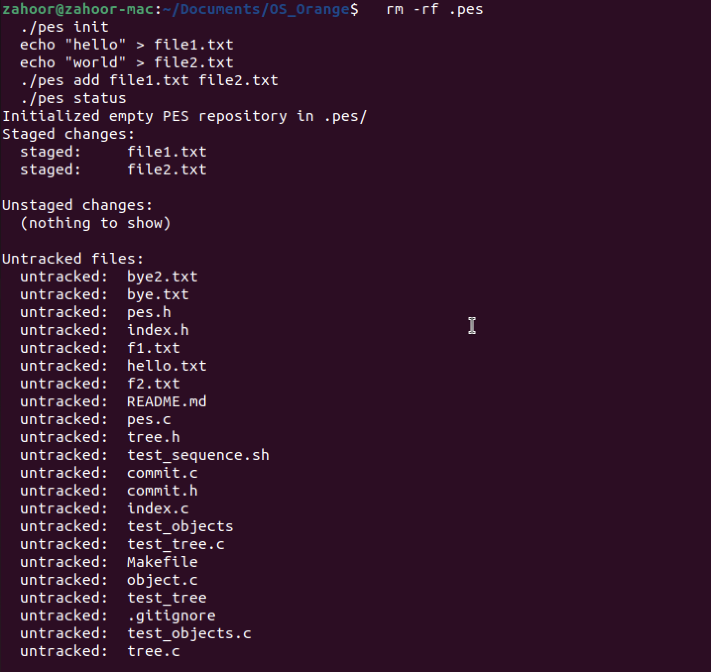
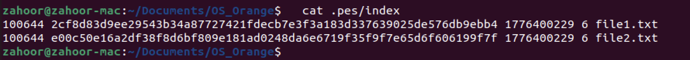
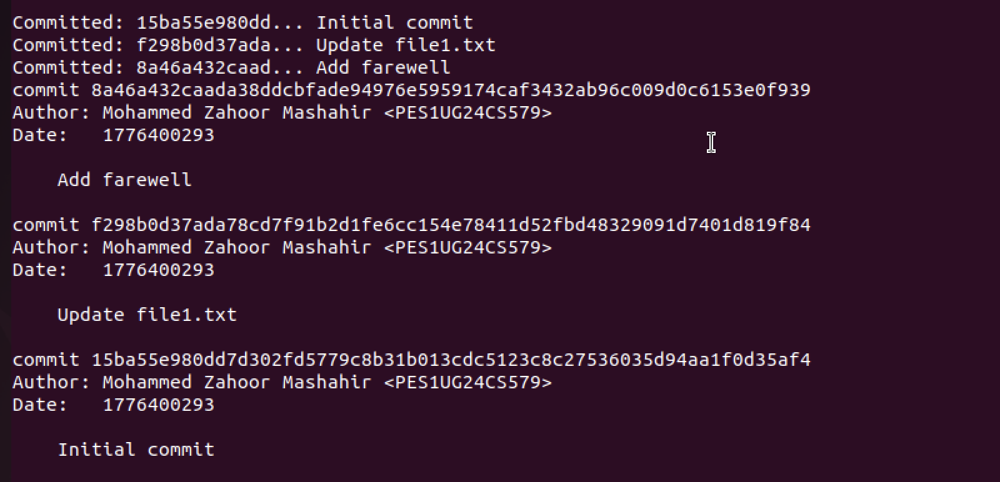
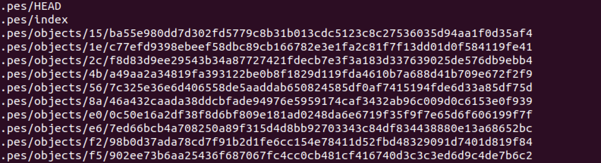
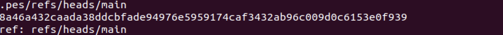
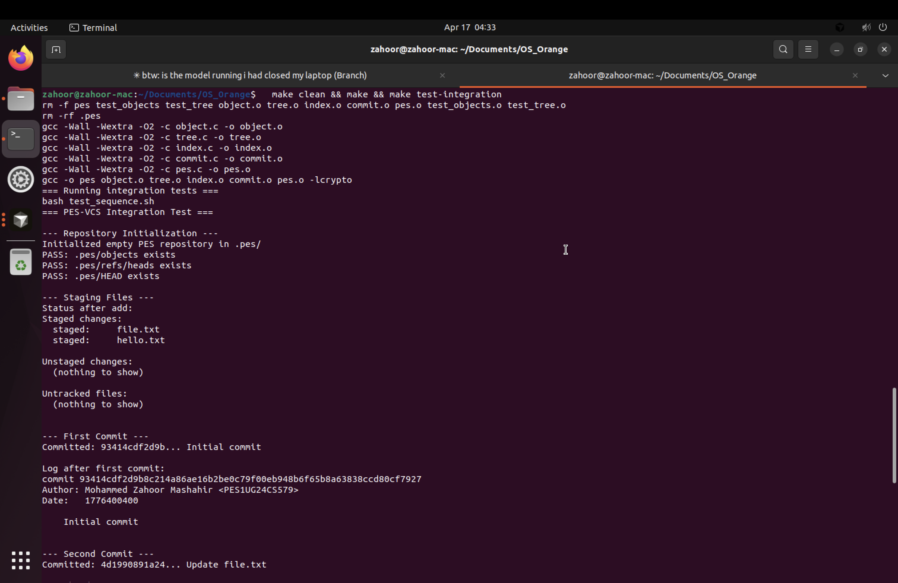
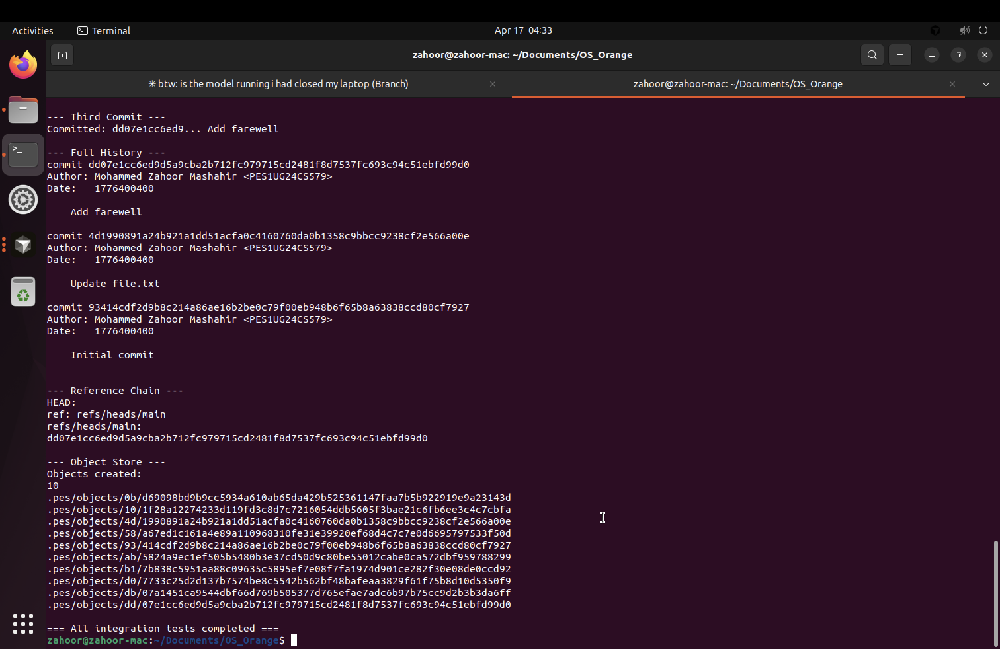

# PES-VCS Lab Report

**Name:** Mohammed Zahoor Mashahir  
**SRN:** PES1UG24CS579  
**Platform:** Ubuntu 22.04

---

## Build Instructions

```bash
sudo apt update && sudo apt install -y gcc build-essential libssl-dev
export PES_AUTHOR="Mohammed Zahoor Mashahir <PES1UG24CS579>"
make all
```

---

## Phase 1 — Object Storage Foundation

Files modified: `object.c`

`object_write` prepends a `"<type> <size>\0"` header to the data, hashes the
whole thing with SHA-256, skips writing if the object already exists
(deduplication), creates the shard directory, writes to a temp file, fsyncs,
and renames atomically. This guarantees the object store is never left with a
partial file even on a crash.

`object_read` reverifies the SHA-256 after reading (integrity check), parses
the type and declared size from the header, validates the declared size against
the actual byte count, then returns the data portion in a caller-owned buffer.

### Screenshot 1A — `./test_objects`



### Screenshot 1B — `find .pes/objects -type f`


---

## Phase 2 — Tree Objects

Files modified: `tree.c`, `Makefile`

`tree_from_index` heap-allocates the `Index` struct (it is ~5.6 MB, which
exceeds the safe stack budget), loads the index, sorts entries by path, then
calls the recursive `write_tree_level` helper.

`write_tree_level` walks the sorted entries at one directory level. For each
plain file entry (no `/` in the remaining path) it adds a blob `TreeEntry`. For
each directory it groups all entries that share the top-level component,
recurses to get the subtree's hash, and adds a `040000` tree entry. After
processing all entries it serialises the `Tree` struct and writes it to the
object store.

### Screenshot 2A — `./test_tree`



### Screenshot 2B — `xxd` of a raw tree object



---

## Phase 3 — The Index (Staging Area)

Files modified: `index.c`

`index_load` opens `.pes/index` with `fopen("r")` and parses each line with
`fscanf` using the format `%o %64s %llu %u %511s`. A missing index file is
treated as an empty staging area, not an error.

`index_save` makes a heap-allocated sorted copy (again to avoid a large stack
frame), writes to a `.tmp` file, calls `fflush` + `fsync` for durability, then
renames atomically.

`index_add` reads the file, stores it as `OBJ_BLOB`, stats the file for
mtime/size metadata used for fast change detection, upserts the entry, and
calls `index_save`.

### Screenshot 3A — `pes init` → `pes add` → `pes status`



### Screenshot 3B — `cat .pes/index`



---

## Phase 4 — Commits and History

Files modified: `commit.c`

`commit_create` calls `tree_from_index` to snapshot the staged state, reads
the current HEAD to find the parent commit (absent for the first commit),
fills a `Commit` struct with author (`PES_AUTHOR` env var), Unix timestamp, and
message, serialises it with `commit_serialize`, stores it via
`object_write(OBJ_COMMIT)`, then calls `head_update` to advance the branch
pointer atomically.

### Screenshot 4A — `pes log` with three commits



### Screenshot 4B — `find .pes -type f | sort`



### Screenshot 4C — Reference chain



### Final — `make test-integration`





---

## Phase 5 — Branching and Checkout

### Q5.1 — How would you implement `pes checkout <branch>`?

**Files that must change in `.pes/`:**

1. `.pes/HEAD` — rewrite the line from `ref: refs/heads/<current>` to
   `ref: refs/heads/<target>`.
2. If the target branch is new, create `.pes/refs/heads/<target>` pointing to
   the desired commit hash.

**Working-directory update:**

1. Read the target branch tip from `.pes/refs/heads/<branch>`.
2. `object_read` the root tree of that commit.
3. Recursively walk the tree: for blob entries write (or overwrite) the file in
   the working directory; for tree entries (mode `040000`) create directories.
4. Delete any working-directory file that is present in the *current* HEAD's
   tree but absent from the target tree.

**What makes this complex:**

- **Dirty-file conflicts.** If a tracked file has local modifications and the
  target branch has a different version of that file, checkout must refuse or
  the user's edits are destroyed silently.
- **Untracked-file collisions.** If an untracked file sits at a path that the
  target tree would create, checkout must refuse to avoid clobbering it.
- **Partial failure.** A crash halfway through leaves a mixed working directory.
  A production implementation writes a lock or in-progress marker to allow
  recovery.
- **Three-way diff.** Deciding which files to touch requires comparing the
  current-HEAD tree, the target-HEAD tree, and the index all at once.

### Q5.2 — Detecting dirty working-directory conflicts

Using only the index and the object store:

1. Load the current index (the staged snapshot matching HEAD after the last
   commit).
2. For each entry, `stat()` the working-directory file. If `st_mtime` or
   `st_size` differs from the stored values, re-hash the file (SHA-256) and
   compare to the stored hash. A mismatch means the file is dirty.
3. For each path in the target branch's tree: if that path is in the index and
   is dirty (step 2), refuse checkout for that path.
4. For untracked files: if a path in the target tree does not appear in the
   index but already exists on disk, refuse checkout to avoid overwriting it.

The mtime/size check is a fast first pass; the full hash re-read is the
authoritative check used only when metadata differs.

### Q5.3 — Detached HEAD and recovery

When HEAD holds a raw commit hash instead of `ref: refs/heads/<branch>`,
`head_update` writes new hashes directly into HEAD. Commits still chain
correctly via parent pointers, but no branch file is updated. Once you check
out a branch, HEAD is overwritten and the detached chain has no ref pointing
to it — it becomes unreachable from all named references.

**Recovery before switching away:**

```bash
cat .pes/HEAD                            # note the hash
echo <hash> > .pes/refs/heads/recovered
echo "ref: refs/heads/recovered" > .pes/HEAD
```

**Recovery after switching away:** the commit objects still exist in the object
store. Walk every file under `.pes/objects/`, call `object_read` on each, and
look for `OBJ_COMMIT` objects whose parent chain leads to your lost work. Git
calls this `git fsck --lost-found`. The GC grace period (see Q6.2) keeps the
objects safe for at least two weeks.

---

## Phase 6 — Garbage Collection

### Q6.1 — Algorithm to find and delete unreachable objects

**Mark-and-sweep:**

*Mark phase — build the reachable set:*

1. Enumerate every file under `.pes/refs/` and read `HEAD` to get the GC roots.
2. For each root commit hash, call `object_read`. Add its hash, the tree hash,
   and every blob/subtree hash found by recursively walking the tree to a
   `reachable` set. Follow each commit's parent pointer until `has_parent == 0`.

*Data structure:* a sorted array of `ObjectID` (32 bytes each) with binary
search — O(n log n) to build, O(log n) per lookup. A hash table gives O(1)
average lookup for larger repos.

*Sweep phase — delete unreachable objects:*

Walk every file under `.pes/objects/XX/`. Reconstruct the full hash from the
directory name and filename, convert with `hex_to_hash`. If not in `reachable`,
call `unlink()`.

**Estimate for 100,000 commits, 50 branches:**

Assuming roughly four unique objects per commit on average (one commit, one to
two trees, one to two new blobs, the rest shared):

- Reachable set ≈ 400,000 objects → 400,000 `object_read` calls in the mark
  phase.
- Sweep: walk all ~400,000 files in the object store.
- Total: roughly **800,000 file accesses**.

### Q6.2 — Race condition between GC and a concurrent commit

**The race:**

| Time | `pes commit` | GC |
|------|-------------|-----|
| t1 | `object_write(OBJ_BLOB)` stores blob B | — |
| t2 | — | Mark phase reads HEAD → old commit. B is not reachable from any ref. |
| t3 | `object_write(OBJ_TREE)` creates tree T referencing B | — |
| t4 | — | Sweep: B is not in reachable set → `unlink(B)` |
| t5 | `object_write(OBJ_COMMIT)` + `head_update` completes | — |

Result: HEAD now points to a commit whose tree references the deleted blob B.
The repository is corrupt.

**How Git avoids this:**

1. **Grace period (`gc.pruneExpire`, default 2 weeks).** GC skips any loose
   object whose filesystem `mtime` is younger than the grace period. A freshly
   written blob is always newer than two weeks, so it is never collected before
   it is referenced by a commit.
2. **Keep-alive refs.** Git writes temporary refs (`FETCH_HEAD`, `MERGE_HEAD`,
   `ORIG_HEAD`) during in-flight operations, so GC sees those objects as
   reachable roots.
3. **Pack-before-prune ordering.** When converting loose objects to pack files,
   Git writes and verifies the pack before deleting any loose objects, so there
   is never a window where an object exists only in a half-written pack.
4. The atomic rename used when writing objects does not help here — blob B is
   fully written before GC runs. Only the grace period closes the time window
   reliably.
